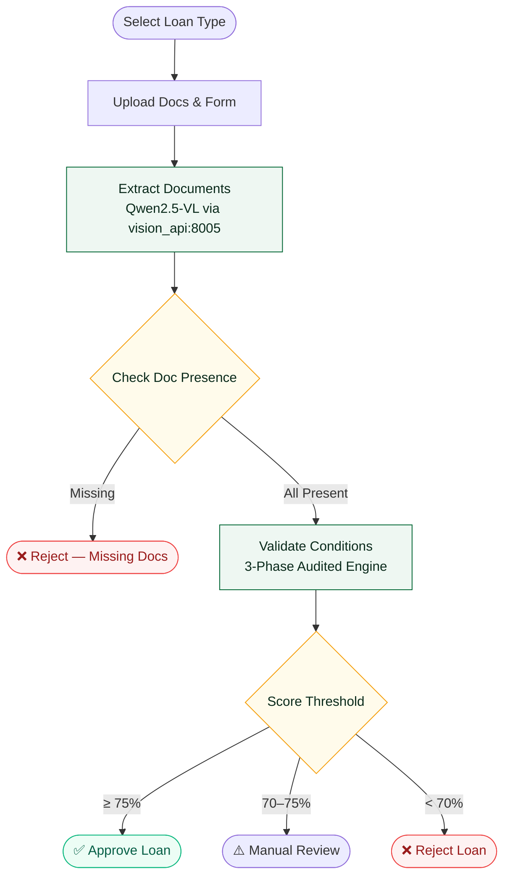

<div align="center">

# 🏦 Egyptian Loan Automation System

**End-to-end, production-grade loan origination platform powered by fine-tuned Qwen2.5-VL-7B vision intelligence**

[](https://python.org)
[](https://docker.com)
[](https://langchain.com)
[](https://nvidia.com)
[](LICENSE)

[**Live Demo**](#-running-the-system) · [**Architecture**](#%EF%B8%8F-system-architecture) · [**Docker Setup**](#-docker-setup-recommended) · [**Fine-tuning**](#-fine-tuning-the-model)

</div>

---

## 📋 Overview

This system automates Egyptian bank loan origination by combining:

- 🧠 **Fine-tuned Qwen2.5-VL-7B** — native vision model trained on Egyptian documents (National IDs, HR letters, tax cards, utility bills, etc.)
- ⚙️ **LangGraph state-machine** — orchestrates the full loan workflow from document upload to final approval/rejection
- 🐳 **Full Docker Compose stack** — 8 microservices, one command to start everything
- 🔒 **Deterministic fraud prevention** — cross-document validation with mathematical scoring (zero LLM hallucination risk)

---

## 🏛️ System Architecture

### Microservices

```
┌─────────────────────────────────────────────────────────────┐
│                     localhost:5050                          │
│                  🌐 Loan Portal (Flask)                      │
│              LangGraph Workflow Orchestration                │
└──────────────────────────┬──────────────────────────────────┘
                           │
          ┌────────────────┼────────────────┐
          ▼                ▼                ▼
   ┌─────────────┐  ┌─────────────┐  ┌─────────────┐
   │ vision_api  │  │ orchestrator│  │  extractor  │
   │  :8005      │  │   :8013     │  │  service    │
   │ Qwen2.5-VL  │  │  Merge +    │  │   :8014     │
   │  GPU ⚡     │  │  Validate   │  │ EasyOCR+VLM │
   └─────────────┘  └──────┬──────┘  └─────────────┘
                           │
          ┌────────────────┼────────────────┐
          ▼                ▼                ▼
   ┌─────────────┐  ┌─────────────┐  ┌─────────────┐
   │national_id  │  │ hr_letter   │  │    form     │
   │ service     │  │  service    │  │   service   │
   │   :8010     │  │   :8011     │  │   :8012     │
   └─────────────┘  └─────────────┘  └─────────────┘
```

| Service | Port | Description |
|---------|------|-------------|
| `loan_portal` | `5050` | Flask web UI + LangGraph orchestration |
| `vision_api` | `8005` | Fine-tuned Qwen2.5-VL-7B — multipart document extraction (GPU) |
| `orchestrator` | `8013` | Merge + cross-validate all service outputs |
| `national_id_service` | `8010` | Egyptian National ID pipeline (EasyOCR + VLM) |
| `hr_letter_service` | `8011` | HR salary letter extraction + signature detection |
| `form_service` | `8012` | Loan form extraction (Google Sheets + manual) |
| `extractor_service` | `8014` | Generic NBE document extractor (EasyOCR + OpenCV boxes) |
| `generator` | `8002` | Synthetic HR document generator (testing) |

### LangGraph Workflow



---

## 🛡️ 3-Phase Audited Validation Engine

The validation engine (`validate_conditions.py`) runs three sequential phases with **zero LLM math involvement** — all scoring is deterministic Python:

### Phase 1 — Structural Correction
| Check | Action |
|-------|--------|
| Birthdate derivation from National ID digits | Programmatic decode (century digit `2`→19xx, `3`→20xx) |
| Expiry date hotfixes | Correct known OCR date transpositions |
| Schema alignment | Normalize field names across document types |

### Phase 2 — Cross-Document Auditing
| Discrepancy | Penalty |
|-------------|---------|
| National ID difference ≤ 3 digits | −20% flat deduction |
| National ID difference > 3 digits | −40% flat deduction |
| Full name mismatch between documents | Score capped at **50%** |
| Both name AND ID differ (double fraud signal) | Hard-forced to **0%** |

### Phase 3 — Form vs. Extracted Verification
| Check | Penalty |
|-------|---------|
| Salary discrepancy (HR letter vs. form) | −5% flat |
| Loan amount > 3,000,000 EGP | Score capped at **50%** |

---

## 📂 Repository Structure

```
loan-automation/
│
├── 🌐 loan_processing/          Flask Portal + LangGraph Workflow
│   ├── nodes/
│   │   ├── extract_documents.py     Sends docs to vision_api for extraction
│   │   ├── validate_conditions.py   3-phase deterministic scoring engine
│   │   ├── check_doc_presence.py    Verifies all required docs are readable
│   │   ├── score_threshold.py       Routes approve / review / reject
│   │   └── final_nodes.py           Audit log + termination states
│   ├── edges/routers.py             Conditional routing logic
│   ├── templates/index.html         Arabic RTL UI (Glassmorphism design)
│   ├── static/                      CSS + JS assets
│   ├── app.py                       Flask entry point (port 5050)
│   ├── graph.py                     LangGraph StateGraph compiler
│   ├── llm_client.py                HTTP bridge to vision_api:8005
│   ├── config.py                    Loan types, required docs, conditions
│   ├── state.py                     GraphState TypedDict
│   ├── Dockerfile                   Production container (python:3.10-slim)
│   └── requirements.txt
│
├── 🧠 nbe_finetune/             Fine-tuning Pipeline + Vision API
│   ├── demo/
│   │   ├── api.py               FastAPI Vision Extraction Server (port 8005)
│   │   ├── Dockerfile           CUDA 12.8 container (nvidia/cuda base)
│   │   ├── requirements.txt     PyTorch cu128 + transformers stack
│   │   └── static/index.html    Standalone extraction demo UI
│   ├── local_llm_client.py      Loads fine-tuned LoRA adapter into VRAM
│   ├── train.py                 HuggingFace PEFT LoRA training loop
│   ├── evaluate.py              Field-level exact-match evaluation
│   ├── build_dataset.py         Converts labeled images → Qwen JSONL
│   └── run_finetune.ps1         Full train + evaluate automation script
│
├── 🔧 Microservices
│   ├── national_id_service/     Egyptian National ID extraction pipeline
│   ├── hr_letter_service/       HR salary letter + signature detection
│   ├── form_service/            Loan form OCR + Google Sheets integration
│   ├── orchestrator_service/    Cross-service merge and validation
│   ├── extractor_service/       Generic NBE doc extractor (EasyOCR+VLM)
│   └── generator_service/       Synthetic HR document generator
│
├── docker-compose.yml           Full 8-service stack definition
├── .dockerignore                Build context exclusions
└── .env                         API keys (not committed)
```

---

## 🚀 Docker Setup (Recommended)

> **Requirements:** WSL2 Ubuntu + Docker + `nvidia-container-toolkit` (for GPU)

### 1. Install NVIDIA Container Toolkit (first time only)

```bash
# In WSL2 Ubuntu terminal
distribution=$(. /etc/os-release; echo $ID$VERSION_ID)
curl -s -L https://nvidia.github.io/nvidia-docker/gpgkey | sudo apt-key add -
curl -s -L https://nvidia.github.io/nvidia-docker/$distribution/nvidia-docker.list \
  | sudo tee /etc/apt/sources.list.d/nvidia-docker.list
sudo apt-get update && sudo apt-get install -y nvidia-container-toolkit
sudo systemctl restart docker
```

### 2. Copy HuggingFace Cache to WSL2 (first time only — avoids re-downloading 14GB)

```bash
# Copies the Qwen2.5-VL-7B base model from Windows to WSL2 native ext4
# (Needed for fast ~5s startup instead of downloading over the internet)
rsync -ah --progress \
  /mnt/c/Users/<YOUR_USER>/.cache/huggingface/hub/models--Qwen--Qwen2.5-VL-7B-Instruct \
  ~/.cache/huggingface/hub/
```

> Update the path in `docker-compose.yml` → `vision_api` → volumes to match your WSL2 username:
> ```yaml
> - /home/<YOUR_USERNAME>/.cache/huggingface:/root/.cache/huggingface
> ```

### 3. Configure Environment

```bash
cp .env.example .env   # then fill in your API keys
```

```env
VISION_API_KEY=nvapi-...       # NVIDIA NIM API key
NVIDIA_API_KEY=nvapi-...       # NVIDIA API key
HF_TOKEN=hf_...                # HuggingFace token (for base model download)
GOOGLE_SHEET_ID=               # Optional: Google Sheets integration
```

### 4. Build & Start All Services

```bash
# First time — builds all 8 images and starts containers
wsl -d Ubuntu docker compose -f /mnt/e/projects/backup/loan/docker-compose.yml up -d --build

# Subsequent starts (no rebuild)
wsl -d Ubuntu docker compose -f /mnt/e/projects/backup/loan/docker-compose.yml start
```

### 5. Open the Portal

Navigate to **[http://localhost:5050](http://localhost:5050)**

### Useful Commands

```bash
# View logs for all services
wsl -d Ubuntu docker compose -f /mnt/e/.../docker-compose.yml logs -f

# View specific service logs
wsl -d Ubuntu docker logs loan-vision_api-1 -f

# Check all container statuses
wsl -d Ubuntu docker compose -f /mnt/e/.../docker-compose.yml ps

# Stop all services
wsl -d Ubuntu docker compose -f /mnt/e/.../docker-compose.yml stop
```

---

## 💻 Local Development Setup (Without Docker)

### Prerequisites
- Windows 10/11 + PowerShell
- Python 3.10+
- NVIDIA GPU (24GB+ VRAM recommended — RTX 3090/4090/5090)
- CUDA 12.8

### Setup

```powershell
# Clone the repository
git clone https://github.com/Efadatek/loan-automation.git
cd loan-automation

# Create & activate virtual environment
python -m venv .venv
.\.venv\Scripts\Activate.ps1

# Install loan portal dependencies
pip install -r loan_processing/requirements.txt

# Install vision API dependencies (ML stack)
pip install --extra-index-url https://download.pytorch.org/whl/cu128 `
    torch==2.7.1+cu128 torchvision==0.22.1+cu128
pip install -r nbe_finetune/demo/requirements.txt
```

### Running Locally (2 terminals)

**Terminal 1 — Vision API** (loads Qwen2.5-VL into VRAM, ~30s startup):
```powershell
.\.venv\Scripts\Activate.ps1
python nbe_finetune\demo\api.py
# → http://localhost:8005
```

**Terminal 2 — Loan Portal**:
```powershell
.\.venv\Scripts\Activate.ps1
python loan_processing\app.py
# → http://localhost:5050
```

---

## 🧠 Fine-tuning the Model

The model was fine-tuned on Egyptian banking documents using PEFT LoRA on top of `Qwen/Qwen2.5-VL-7B-Instruct`.

### Training Pipeline

```powershell
# Full automated pipeline: build dataset → train → evaluate
.\nbe_finetune\run_finetune.ps1
```

### Individual Steps

```powershell
# 1. Build training dataset from labeled images
python nbe_finetune\build_dataset.py

# 2. Run PEFT LoRA fine-tuning
python nbe_finetune\train.py

# 3. Evaluate field-level exact-match accuracy
python nbe_finetune\evaluate.py
```

**Training Config:**
- Base model: `Qwen/Qwen2.5-VL-7B-Instruct`
- PEFT method: LoRA (`r=16`, `alpha=32`, target: `q_proj`, `v_proj`)
- Precision: `bfloat16`
- GPU: RTX 5090 (CUDA 12.8, sm_120)
- Best checkpoint saved to: `nbe_finetune/output/checkpoints/best/`

---

## 📊 Supported Document Types

| Document | Arabic Name | Loan Types |
|----------|-------------|------------|
| National ID (Front + Back) | بطاقة الرقم القومي | All |
| HR Letter | خطاب من جهة العمل | Personal, Salary Transfer |
| Utility Bill | فاتورة مرافق | Mortgage, Business |
| Electricity Bill | فاتورة كهرباء | Mortgage, Business |
| Tax Card | البطاقة الضريبية | Business, Commercial |
| Commercial Register | السجل التجاري | Business |
| Practice License | رخصة مزاولة المهنة | Professional |
| Syndicate Card | كارنيه النقابة | Professional |
| Clinic License | ترخيص عيادة | Medical |
| Bank Statement | كشف حساب بنكي | All premium |
| Ownership / Lease Contract | عقد ملكية / إيجار | Mortgage |
| Salary Transfer Pledge | تعهد تحويل راتب | Salary Transfer |
| Pension Transfer Pledge | تعهد تحويل معاش | Pension |

---

## 🛠️ Troubleshooting

**Port conflict (address already in use):**
```powershell
# Find and kill the conflicting process
Get-NetTCPConnection -LocalPort 5050, 8005 -ErrorAction SilentlyContinue `
  | Format-Table LocalAddress, LocalPort, State, OwningProcess
Stop-Process -Id <OwningProcess> -Force
```

**vision_api slow to start (stuck loading):**
- Make sure you've copied the HF cache to WSL2 native filesystem (see step 2 above)
- The base model must be in `/home/<user>/.cache/huggingface/` — not `/mnt/c/...`
- After first-time setup, startup takes ~5 seconds

**Documents extracted but 0% score:**
- Ensure `QWEN_API_URL=http://vision_api:8005` in `docker-compose.yml` (not `extractor_service:8014`)
- Check vision_api is fully started: `docker logs loan-vision_api-1 | grep "Model ready"`

---

## 📄 License

MIT License — see [LICENSE](LICENSE) for details.

---

<div align="center">
Built with ❤️ for Egyptian banking automation · Powered by Qwen2.5-VL + LangGraph
</div>
