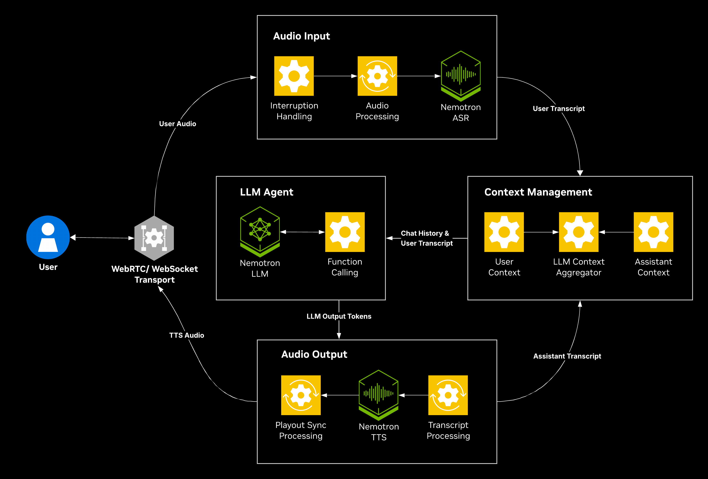

# Generic - cascaded pipeline example

Generic cascaded voice pipeline using Pipecat's built-in NVIDIA services (`NvidiaSTTService` -> `NvidiaLLMService` with function calling -> `NvidiaTTSService`). It is a minimal, production-shaped cascaded voice assistant that keeps ASR, LLM, tools, and TTS as separate services, and it works as the baseline cascaded reference or the starting point for your own use case.



## Running the example

This example runs on every deployment profile: **Cloud** (no local GPU, NVCF endpoints), **Workstation** (single GPU), **DGX Spark** (Blackwell, 128 GB unified memory), and **Jetson Thor** (edge). See the [Getting Started guide](../../../docs/01-getting-started.md) for prerequisites and hardware detail. Run commands from the repository root.

1. Create your `.env` from the template and set your NVIDIA API key:

   ```bash
   cp .env.example .env
   export NVIDIA_API_KEY=<your-nvidia-api-key>
   ```

   > **DGX Spark and Jetson Thor:** also set `HF_TOKEN` in `.env`. These profiles serve the LLM with vLLM, which downloads the model weights from Hugging Face. The Workstation profile uses a NIM from NGC and does not need it.

2. Log in to the NVIDIA NGC container registry:

   ```bash
   printf '%s' "$NVIDIA_API_KEY" | docker login nvcr.io -u '$oauthtoken' --password-stdin
   ```

3. Deploy the profile that matches your hardware:

   ```bash
   docker compose --profile generic-assistant up -d              # Cloud (no local GPU)
   docker compose --profile generic-assistant/workstation up -d  # Workstation
   docker compose --profile generic-assistant/dgx-spark up -d    # DGX Spark
   docker compose --profile generic-assistant/jetson-thor up -d  # Jetson Thor
   ```

   | Recipe profile | App service | Sidecars |
   | --- | --- | --- |
   | `generic-assistant` | `generic-assistant` | none (cloud NVCF) |
   | `generic-assistant/workstation` | `generic-assistant` | `nvidia-llm`, `nemotron-asr-streaming-english`, `tts-service` |
   | `generic-assistant/dgx-spark` | `generic-assistant` | `nvidia-llm-vllm`, `nemotron-asr-streaming-english`, `tts-service` |
   | `generic-assistant/jetson-thor` | `generic-assistant` | `nvidia-llm-vllm`, `nemotron-speech` |

   > Jetson Thor needs a one-time Riva model build first. Follow the [Jetson Thor guide](../../../docs/03-jetson-thor.md).

4. Open the UI at `https://localhost:7860/`. Keep TLS enabled for browser UI testing. `PIPELINE_TLS=false` serves plain HTTP for headless performance and API testing. For plain-HTTP browser testing, see [browser access](../../../docs/06-troubleshooting.md#browser-access).

5. Clean up when you are done by tearing down with the same profile you started with:

   ```bash
   docker compose --profile generic-assistant down              # Cloud (no local GPU)
   docker compose --profile generic-assistant/workstation down  # Workstation
   docker compose --profile generic-assistant/dgx-spark down    # DGX Spark
   docker compose --profile generic-assistant/jetson-thor down  # Jetson Thor
   ```

To run host-native without Docker, set `selection: generic-assistant` in [`examples_registry.yaml`](../../../examples_registry.yaml), then run `uv run python3 src/server.py`.

## Customization

| Path | Role |
| --- | --- |
| `pipeline.py` | Pipecat entry point for the generic example |
| `prompts.yaml` | example-local prompt catalog. Each entry may list `tools_available` to gate function calling per prompt |
| `tools.yaml` | OpenAI function-calling schemas, keyed by tool name |
| `tool_handlers.py` | async handlers for each schema in `tools.yaml`, exposed via the `TOOL_HANDLERS` registry |
| `tools.py` | builds a filtered `ToolsSchema` from `tools.yaml` for the tool names a prompt requests, skipping entries without a matching handler |
| `services.cloud.yaml`, `services.local.yaml` | example-local service catalogs |

To change models, voices, prompts, or tool wiring, see [Configure Services](../../../docs/how-to/configure-services.md), [Configure LLM](../../../docs/how-to/configure-llm.md), [Configure ASR](../../../docs/how-to/configure-asr.md), [Configure TTS](../../../docs/how-to/configure-tts.md), and [Configure Prompts](../../../docs/how-to/configure-prompts.md).

## Tips & best practices

- **Start from this baseline.** The generic example is intentionally minimal. Add domain logic, custom tools, and deployment-specific service choices on top of it rather than starting from scratch.
- **Pick the model for the deployment.** Nemotron 3 Nano suits latency-sensitive local profiles. Nemotron 3.5 Lightning is the default cloud model, while Nemotron 3 Super offers higher capability for complex tasks. See [Configure LLM](../../../docs/how-to/configure-llm.md) for sizing and precision.
- **Tune turn-taking and latency** with the shared pipeline knobs in [Tune Pipeline Performance](../../../docs/how-to/tune-pipeline-performance.md).
- For deployment, ASR/LLM/TTS, and general failure modes, see the [Troubleshooting guide](../../../docs/06-troubleshooting.md).
